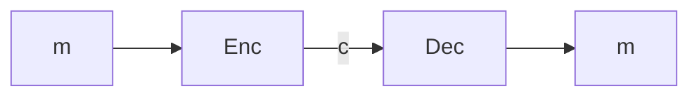

---
## One-Time Pad

---

- This chapter is about the classic problem of **Private communication**
- **Alice** has a message that she wants to convey to **Bob**, while also keeping the contents of the message hidden from an eavesdropper **Eve**.

### 1.1 What Is (Not) Cryptography?

- Cryptography can provide solutions to cleanly defined problems that often abstract away important but messy real - world concerns. 
- It can give guarantees about what happens in the presence of certain well - defined classes of attacks. but these guarantees may not apply in real world attackers.

### Encryption Basics and Terminology : 

- **Participants**
	- Alice : The sender of the message
	- Bob : The receiver of the message
	- Eve : The eavesdropper who can observe the communication but should not learn the message 
- **Message and Transformation**
	- Plaintext ($m$) : The original message Alice wants to send privately to Bob
	- Ciphertext ($c$) : The encrypted version of the message that Alice sends over the insecure channel 
- **Encryption**
	- The process of converting plaintext '$m$' into ciphertext '$c$'
	- denoted as $c = Enc( k, m )$ 
	- where $Enc$ is the encryption algorithm used and $k$ is the encryption key.
- **Decryption**
	- The process Bob uses to recover the plaintext from the ciphertext
	- Denoted as $m = Dec( k, c )$
	- where $Dec$ is the decryption algorithm used and k is the decryption key.

- **Security Goals**
	- Eve may observe the ciphertext $c$, but should not be able to learn anything meaningful about the original plaintext $m$.
	- Only Bob who possesses the correct decryption key, should be able to recover $m$.

